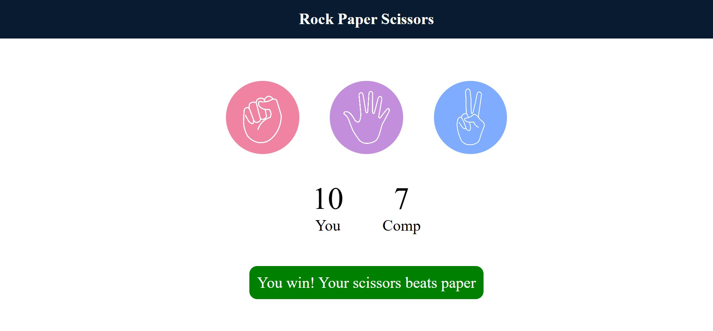

# ✊✋✌️ Rock Paper Scissors Game  

A fun and interactive **Rock Paper Scissors** game built using **HTML, CSS, and JavaScript**.  
Play against the computer, try to win rounds, and keep track of scores in real-time!  

---

## 🚀 Features  
- Simple Rock, Paper, Scissors gameplay.  
- Real-time score tracking (User vs Computer).  
- Color-coded messages to show game results.  
- Responsive and easy-to-use interface.  

---

## 🛠️ Tech Stack  
- **HTML5** – Game structure  
- **CSS3** – Styling and layout  
- **JavaScript (Vanilla JS)** – Game logic  

---

## 📂 Project Structure  

---

## 🎯 How to Play  
1. Open `index.html` in your browser.  
2. Click one of the three choices:  
   - Rock  
   - Paper  
   - Scissors  
3. The computer randomly selects its choice.  
4. See the result message and scores update dynamically.  
5. Play again anytime by clicking a choice.  

---

## 📸 Screenshot  

  

---
## 🙌 Author

## 👨‍💻 Ganapaka Komal Babu
## 🎓 Student at Sreenidhi Institute of Science and Technology
## 💡 Goal: To become a Software Engineer
